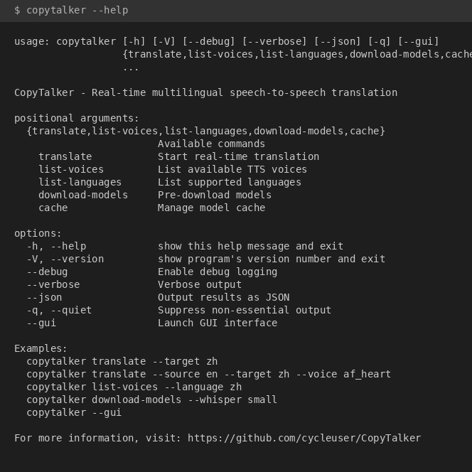

# CopyTalker

[](https://www.gnu.org/licenses/gpl-3.0)
[](https://www.python.org/downloads/)
[](https://badge.fury.io/py/copytalker)

**CopyTalker** 是一个跨模态数据转换驱动的异步多语音翻译系统。它能够实现实时语音到语音的翻译，支持多种语言和声音，利用最先进的机器学习模型进行语音识别、翻译和合成。

## 功能特性

- **实时语音翻译**：即时将口语翻译成另一种语言并语音输出
- **多语言支持**：支持9种语言之间的翻译，包括英语、中文、日语、韩语、法语、德语、西班牙语、俄语和阿拉伯语
- **多种TTS引擎**：Kokoro（高质量神经网络TTS）、Edge TTS（云端）、pyttsx3（离线）
- **跨平台支持**：完整支持 macOS (Apple Silicon/Intel)、Linux 和 Windows
- **跨模态转换**：从语音到文本再到翻译语音的无缝转换
- **异步处理**：高效的并行处理，延迟最小化
- **简单GUI**：易于使用的Tkinter图形界面
- **离线功能**：可下载模型以供离线使用

## 平台兼容性

| 组件 | macOS (Apple Silicon) | macOS (Intel) | Linux | Windows |
|------|----------------------|---------------|-------|---------|
| 语音识别 (faster-whisper) | CPU (float32) | CPU (float32) | CPU / CUDA | CPU / CUDA |
| 翻译 (transformers) | MPS 加速 | CPU | CPU / CUDA | CPU / CUDA |
| TTS - Edge TTS | 支持 | 支持 | 支持 | 支持 |
| TTS - pyttsx3 | 支持 (NSSpeech) | 支持 (NSSpeech) | 支持 (espeak) | 支持 (SAPI) |
| TTS - Kokoro | MPS 加速 | CPU | CPU / CUDA | CPU / CUDA |
| 音频输入/输出 | sounddevice | sounddevice | sounddevice | sounddevice |

> **注意：** faster-whisper 使用 ctranslate2，不支持 Apple MPS。macOS 上 STT 自动使用 CPU。
> 翻译模型和 Kokoro TTS 可以利用 Apple Silicon 的 MPS 加速。

## 支持的语言

| 代码 | 语言 |
|------|------|
| en | 英语 |
| zh | 中文（简体） |
| ja | 日语 |
| ko | 韩语 |
| fr | 法语 |
| de | 德语 |
| es | 西班牙语 |
| ru | 俄语 |
| ar | 阿拉伯语 |

## 安装

### 从 PyPI 安装（推荐）

基础安装已包含 Edge TTS 和 pyttsx3，TTS 开箱即用：

```bash
pip install copytalker
```

> **Python 3.13 用户：** `audioop-lts` 会自动安装以兼容 pydub。

### 完整安装

```bash
# 安装 Kokoro 高质量 TTS 引擎
pip install copytalker[full]

# 包含CJK语言支持（中文、日文、韩文）
pip install copytalker[full,cjk]
```

### 从源码安装

```bash
git clone https://github.com/cycleuser/CopyTalker.git
cd CopyTalker
pip install -e .[full]
```

### 一键安装脚本（推荐）

为了简化安装过程，CopyTalker 提供了自动安装脚本：

**macOS/Linux:**
```bash
# 下载并运行安装脚本
curl -fsSL https://raw.githubusercontent.com/cycleuser/CopyTalker/main/install.sh -o install.sh
chmod +x install.sh
./install.sh
```

**Windows (PowerShell):**
```powershell
# 下载并运行安装脚本
Invoke-WebRequest -Uri https://raw.githubusercontent.com/cycleuser/CopyTalker/main/install.ps1 -OutFile install.ps1
.\install.ps1
```

安装脚本会自动：
- 检测操作系统和包管理器
- 安装所有系统级依赖（FFmpeg、PortAudio 等）
- 创建虚拟环境（可选）
- 安装 CopyTalker 及所有 TTS 引擎
- 验证安装并运行诊断

### 手动安装系统依赖

CopyTalker 需要 FFmpeg 和 PortAudio 进行音频处理，不同 TTS 引擎还需要额外的依赖：

#### 基础音频依赖

**Ubuntu/Debian:**
```bash
sudo apt update
sudo apt install -y ffmpeg portaudio19-dev libsndfile1
```

**macOS (使用 Homebrew):**
```bash
# 首先安装 Homebrew（如果尚未安装）
/bin/bash -c "$(curl -fsSL https://raw.githubusercontent.com/Homebrew/install/HEAD/install.sh)"

# 安装音频依赖
brew install ffmpeg portaudio libsndfile
```

**Windows:**
- 从 https://ffmpeg.org/download.html 下载 FFmpeg 并添加到 PATH
- PyAudio 已包含预编译二进制文件（通过 pip 安装）

#### TTS 引擎特定依赖

CopyTalker 支持多种 TTS 引擎，每种引擎有不同的依赖要求：

##### 1. Kokoro TTS（推荐 - 高质量神经网络）

Kokoro 是默认的高质量 TTS 引擎，需要额外的语言处理依赖：

**macOS:**
```bash
# 安装 CJK（中日韩）语言处理依赖
pip install cn2an pypinyin pypinyin-dict jieba
pip install fugashi jaconv mojimoji unidic-lite

# 或者使用完整安装
pip install copytalker[full,cjk]
```

**Linux (Ubuntu/Debian):**
```bash
# 安装系统级依赖
sudo apt install -y libmecab-dev mecab mecab-ipadic-utf8

# 安装 Python 依赖
pip install cn2an pypinyin pypinyin-dict jieba
pip install fugashi jaconv mojimoji unidic-lite mecab-python3

# 或者使用完整安装
pip install copytalker[full,cjk]
```

##### 2. Edge TTS（云端 TTS - 需要网络）

Edge TTS 是微软的云端 TTS 服务，无需本地模型但需要网络连接：

```bash
# 安装 edge-tts
pip install edge-tts>=6.1.0

# 测试 Edge TTS 是否可用
edge-tts --list-voices
```

**注意：** Edge TTS 需要稳定的互联网连接。如果显示 "Edge TTS is not available"，请检查：
1. 网络连接是否正常
2. 是否正确安装了 `edge-tts` 包
3. 是否可以访问微软 Azure 服务

##### 3. pyttsx3（离线 TTS - 备用方案）

pyttsx3 是完全离线的 TTS 引擎，作为备用方案：

**macOS:**
```bash
# macOS 使用内置 NSSpeechSynthesizer，无需额外依赖
pip install pyttsx3
```

**Linux (Ubuntu/Debian):**
```bash
# 需要安装 eSpeak NG
sudo apt install -y espeak-ng libespeak1

# 安装 Python 绑定
pip install pyttsx3
```

##### 4. IndexTTS（语音克隆）

IndexTTS 支持情感语音克隆：

**macOS & Linux:**
```bash
# 安装 Pinyin 处理依赖（中文必需）
pip install pynini soundfile

# Linux 额外需要
sudo apt install -y libpynini-dev  # 如果可用
```

##### 5. Fish-Speech（高级语音克隆）

Fish-Speech 提供 50+ 种情感标签：

```bash
# 安装依赖
pip install soundfile

# 或使用云 API
pip install fish-audio-sdk httpx
```

#### 完整安装推荐

**macOS 完整安装步骤：**
```bash
# 1. 安装系统依赖
brew install ffmpeg portaudio libsndfile

# 2. 安装 CopyTalker 及所有功能
pip install copytalker[full,cjk,indextts,fish-speech]

# 3. 验证安装
copytalker --help
copytalker --gui
```

**Linux (Ubuntu/Debian) 完整安装步骤：**
```bash
# 1. 安装系统依赖
sudo apt update
sudo apt install -y ffmpeg portaudio19-dev libsndfile1 \
                    libmecab-dev mecab mecab-ipadic-utf8 \
                    espeak-ng libespeak1

# 2. 安装 CopyTalker 及所有功能
pip install copytalker[full,cjk,indextts,fish-speech]

# 3. 验证安装
copytalker --help
copytalker --gui
```

#### 故障排查

**问题 1: GUI 提示 "Edge TTS is not available"**

解决方法：
```bash
# 检查是否正确安装 edge-tts
pip show edge-tts

# 如果没有安装，执行
pip install edge-tts>=6.1.0

# 测试 edge-tts 命令行工具
edge-tts --list-voices

# 如果无法列出声音，检查网络连接
ping azure.microsoft.com
```

**问题 2: GUI 提示 "No TTS engine available"**

解决方法：
```bash
# 安装所有 TTS 引擎
pip install kokoro edge-tts pyttsx3

# 或者重新安装完整包
pip install copytalker[full]

# 重启 GUI
copytalker --gui
```

**问题 3: Kokoro TTS 无法生成中文/日文语音**

解决方法：
```bash
# 安装 CJK 语言支持
pip install copytalker[cjk]

# 具体依赖
pip install cn2an pypinyin jieba        # 中文
pip install fugashi jaconv unidic-lite  # 日文
```

**问题 4: macOS 上 PyAudio 安装失败**

解决方法：
```bash
# CopyTalker 默认使用 sounddevice（预编译二进制），不需要 PyAudio
# 如果必须使用 PyAudio：
brew install portaudio
pip install pyaudio

# 或者继续使用默认的 sounddevice（推荐）
pip install sounddevice
```

## 快速开始

### 命令行界面

```bash
# 开始实时翻译（英语到中文）
copytalker translate --target zh

# 自动检测源语言
copytalker translate --source auto --target ja

# 指定TTS语音
copytalker translate --target zh --voice zf_xiaobei

# 使用特定TTS引擎
copytalker translate --target en --tts-engine edge-tts

# 列出可用语音
copytalker list-voices --language zh

# 列出支持的语言
copytalker list-languages
```

### 图形界面模式

```bash
# 启动图形界面
copytalker --gui

# 或使用专用命令
copytalker-gui
```

#### 界面截图

**主界面**


主窗口提供所有设置选项、实时转录和翻译显示区域，以及开始翻译、停止和下载模型等控制按钮。

**源语言选择**


选择源语言，或选择自动检测让 Whisper 自动识别说话人的语言。

**目标语言选择**


选择翻译输出的目标语言。

**语音选择**


为目标语言选择 TTS 语音。语音列表会根据所选目标语言和 TTS 引擎动态变化。

**TTS 引擎选择**


可选择 Kokoro（高质量神经网络）、Edge TTS（云端）、pyttsx3（离线）或 auto（自动选择最佳引擎）。

**翻译模型选择**


选择 Helsinki-NLP（特定语言对模型）或 NLLB（多语言模型，支持所有语言对，包括日中互译）。

**翻译设备选择**


将翻译模型分配到 CPU 或 CUDA GPU 上运行，合理分配计算资源。

**TTS 设备选择**


将 TTS 引擎独立分配到 CPU 或 CUDA GPU，避免与翻译模型争抢 GPU 资源。

### Python API

```python
from copytalker import AppConfig, TranslationPipeline

# 配置
config = AppConfig()
config.stt.language = "auto"  # 自动检测源语言
config.translation.target_lang = "zh"  # 翻译到中文
config.tts.engine = "kokoro"  # 使用 Kokoro TTS
config.tts.voice = "zf_xiaobei"  # 中文女声

# 创建并启动流水线
pipeline = TranslationPipeline(config)

# 注册事件回调
def on_transcription(event):
    print(f"识别到: {event.data.text}")

def on_translation(event):
    print(f"翻译为: {event.data.translated_text}")

pipeline.register_callback("transcription", on_transcription)
pipeline.register_callback("translation", on_translation)

# 开始翻译
pipeline.start()

# ... (流水线运行直到停止)

# 停止
pipeline.stop()
```

### 使用上下文管理器

```python
from copytalker import AppConfig, TranslationPipeline

config = AppConfig()
config.translation.target_lang = "ja"

with TranslationPipeline(config) as pipeline:
    # 流水线正在运行
    input("按回车键停止...")
# 流水线自动停止
```

## 模型管理

### 预下载模型

```bash
# 下载 Whisper 模型
copytalker download-models --whisper small

# 下载 Kokoro TTS 模型
copytalker download-models --kokoro

# 下载所有推荐模型
copytalker download-models --all
```

### 缓存管理

```bash
# 显示缓存信息
copytalker cache --info

# 清除所有缓存模型
copytalker cache --clear

# 清除特定类型模型
copytalker cache --clear whisper
```

## 配置

CopyTalker 可以通过以下方式配置：

1. **命令行参数**
2. **环境变量**
3. **配置文件** (`~/.config/copytalker/config.yaml`)

### 环境变量

| 变量 | 描述 | 默认值 |
|------|------|--------|
| `COPYTALKER_CACHE_DIR` | 模型缓存目录 | `~/.cache/copytalker` |
| `COPYTALKER_DEVICE` | 计算设备 (cpu/cuda/auto) | `auto` |
| `COPYTALKER_CONFIG` | 配置文件路径 | `~/.config/copytalker/config.yaml` |

### 配置文件示例

```yaml
audio:
  sample_rate: 16000
  vad_aggressiveness: 3

stt:
  model_size: small
  device: auto

translation:
  target_lang: zh

tts:
  engine: kokoro
  voice: zf_xiaobei
  speed: 1.0

debug: false
```

## 系统架构

CopyTalker 采用模块化流水线架构：

```
┌─────────────────┐     ┌─────────────────┐     ┌─────────────────┐     ┌─────────────────┐
│    音频捕获     │────▶│    语音识别     │────▶│      翻译       │────▶│    语音合成     │
│    (VAD)        │     │   (Whisper)     │     │ (Helsinki/NLLB) │     │    (Kokoro)     │
└─────────────────┘     └─────────────────┘     └─────────────────┘     └─────────────────┘
```

1. **音频捕获**：使用语音活动检测(WebRTC VAD)录制音频
2. **语音识别**：使用 Faster-Whisper 转录
3. **翻译**：使用 Helsinki-NLP 或 NLLB 模型翻译
4. **语音合成**：使用 Kokoro、Edge TTS 或 pyttsx3 合成

## 开发

### 设置开发环境

```bash
git clone https://github.com/cycleuser/CopyTalker.git
cd CopyTalker
pip install -e .[dev]
```

### 运行测试

```bash
# 运行所有测试
pytest

# 带覆盖率运行
pytest --cov=copytalker

# 只运行单元测试
pytest tests/unit/

# 跳过慢测试
pytest -m "not slow"
```

### 代码质量

```bash
# 格式化代码
black src/copytalker tests
isort src/copytalker tests

# 代码检查
ruff check src/copytalker

# 类型检查
mypy src/copytalker
```

## 环境要求

- Python 3.9 或更高版本
- FFmpeg
- PortAudio（用于 PyAudio）
- 音频输入/输出功能

详细 Python 包依赖请参见 [pyproject.toml](pyproject.toml)。

## Agent 集成（OpenAI Function Calling）

CopyTalker 提供 OpenAI 兼容的工具定义，可供 LLM Agent 调用：

```python
from copytalker.tools import TOOLS, dispatch

response = client.chat.completions.create(
    model="gpt-4o",
    messages=messages,
    tools=TOOLS,
)

result = dispatch(
    tool_call.function.name,
    tool_call.function.arguments,
)
```

## CLI 帮助



## 许可证

本项目采用 GNU General Public License v3.0 许可证 - 详情请见 [LICENSE](LICENSE) 文件。

## 贡献

欢迎贡献！请随时提交 Pull Request。

1. Fork 仓库
2. 创建功能分支 (`git checkout -b feature/amazing-feature`)
3. 提交更改 (`git commit -m '添加了很棒的功能'`)
4. 推送到分支 (`git push origin feature/amazing-feature`)
5. 打开 Pull Request

## 致谢

- [faster-whisper](https://github.com/guillaumekln/faster-whisper) 用于语音识别
- [Helsinki-NLP](https://huggingface.co/Helsinki-NLP) 用于翻译模型
- [Facebook NLLB](https://ai.meta.com/research/no-language-left-behind/) 用于多语言翻译
- [Kokoro TTS](https://github.com/hexgrad/kokoro) 用于高质量神经网络TTS
- 各种 TTS 库用于语音合成
