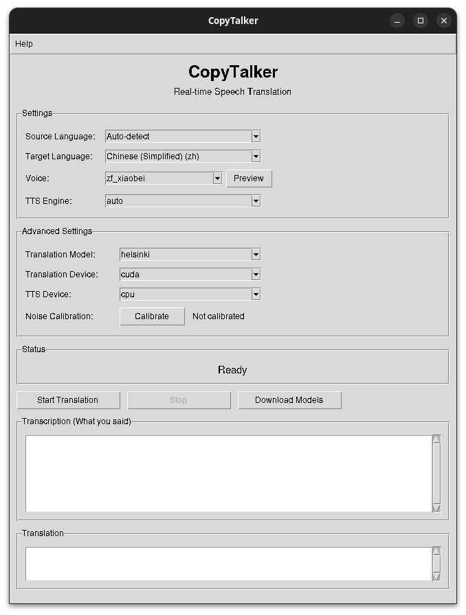
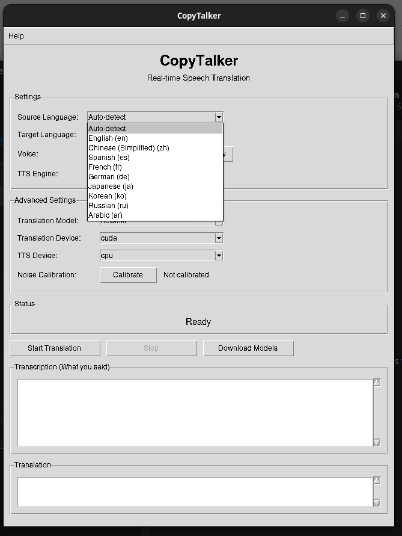
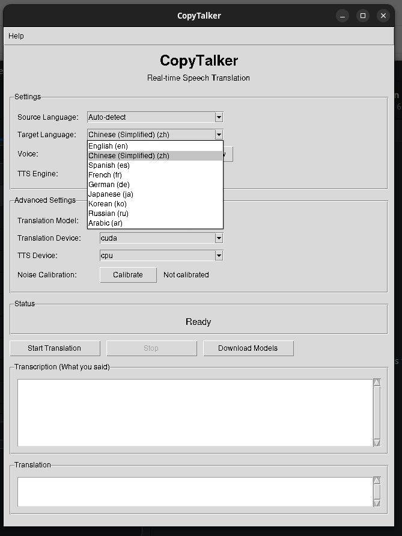
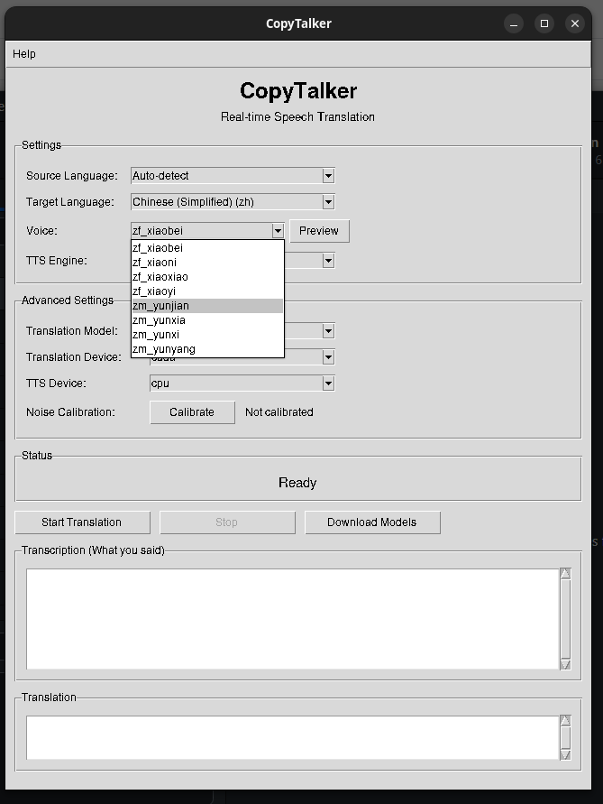
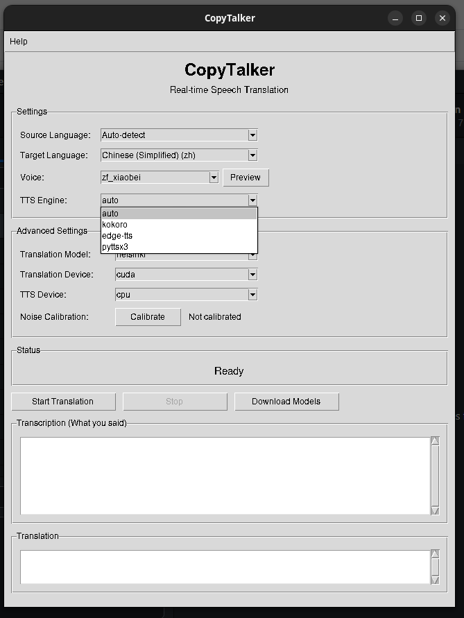
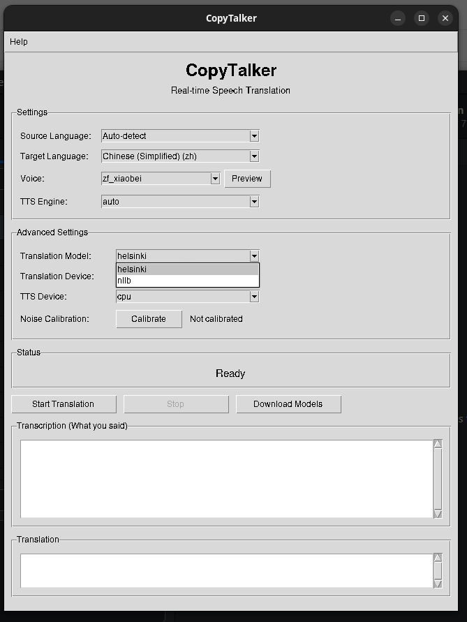
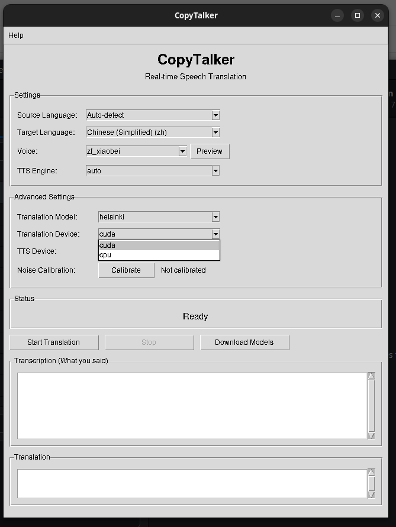
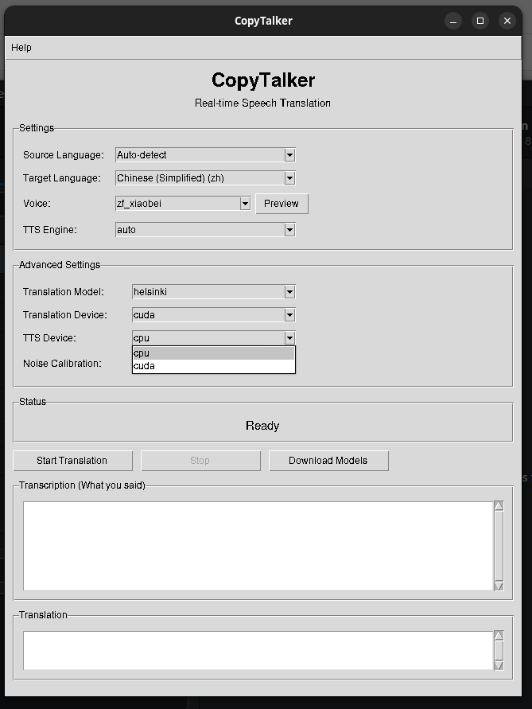

# CopyTalker

[](https://www.gnu.org/licenses/gpl-3.0)
[](https://www.python.org/downloads/)
[](https://badge.fury.io/py/copytalker)

**CopyTalker** 是一个跨模态数据转换驱动的异步多语音翻译系统。它能够实现实时语音到语音的翻译，支持多种语言和声音，利用最先进的机器学习模型进行语音识别、翻译和合成。

## 功能特性

- **实时语音翻译**：即时将口语翻译成另一种语言并语音输出
- **多语言支持**：支持9种语言之间的翻译，包括英语、中文、日语、韩语、法语、德语、西班牙语、俄语和阿拉伯语
- **多种TTS引擎**：Kokoro（高质量神经网络TTS）、Edge TTS（云端）、pyttsx3（离线）
- **跨模态转换**：从语音到文本再到翻译语音的无缝转换
- **异步处理**：高效的并行处理，延迟最小化
- **简单GUI**：易于使用的Tkinter图形界面
- **离线功能**：可下载模型以供离线使用

## 支持的语言

| 代码 | 语言 |
|------|------|
| en | 英语 |
| zh | 中文（简体） |
| ja | 日语 |
| ko | 韩语 |
| fr | 法语 |
| de | 德语 |
| es | 西班牙语 |
| ru | 俄语 |
| ar | 阿拉伯语 |

## 安装

### 从 PyPI 安装（推荐）

```bash
pip install copytalker
```

### 完整安装

```bash
# 安装所有TTS引擎
pip install copytalker[full]

# 包含CJK语言支持
pip install copytalker[full,cjk]

# 开发安装
pip install copytalker[dev]
```

### 从源码安装

```bash
git clone https://github.com/cycleuser/CopyTalker.git
cd CopyTalker
pip install -e .[full]
```

### 系统依赖

CopyTalker 需要 FFmpeg 和 PortAudio 进行音频处理：

**Ubuntu/Debian:**
```bash
sudo apt install ffmpeg portaudio19-dev
```

**macOS:**
```bash
brew install ffmpeg portaudio
```

**Windows:**
从 https://ffmpeg.org/download.html 下载 FFmpeg 并添加到 PATH。

## 快速开始

### 命令行界面

```bash
# 开始实时翻译（英语到中文）
copytalker translate --target zh

# 自动检测源语言
copytalker translate --source auto --target ja

# 指定TTS语音
copytalker translate --target zh --voice zf_xiaobei

# 使用特定TTS引擎
copytalker translate --target en --tts-engine edge-tts

# 列出可用语音
copytalker list-voices --language zh

# 列出支持的语言
copytalker list-languages
```

### 图形界面模式

```bash
# 启动图形界面
copytalker --gui

# 或使用专用命令
copytalker-gui
```

#### 界面截图

**主界面**



主窗口提供所有设置选项、实时转录和翻译显示区域，以及开始翻译、停止和下载模型等控制按钮。

**源语言选择**



选择源语言，或选择自动检测让 Whisper 自动识别说话人的语言。

**目标语言选择**



选择翻译输出的目标语言。

**语音选择**



为目标语言选择 TTS 语音。语音列表会根据所选目标语言和 TTS 引擎动态变化。

**TTS 引擎选择**



可选择 Kokoro（高质量神经网络）、Edge TTS（云端）、pyttsx3（离线）或 auto（自动选择最佳引擎）。

**翻译模型选择**



选择 Helsinki-NLP（特定语言对模型）或 NLLB（多语言模型，支持所有语言对，包括日中互译）。

**翻译设备选择**



将翻译模型分配到 CPU 或 CUDA GPU 上运行，合理分配计算资源。

**TTS 设备选择**



将 TTS 引擎独立分配到 CPU 或 CUDA GPU，避免与翻译模型争抢 GPU 资源。

### Python API

```python
from copytalker import AppConfig, TranslationPipeline

# 配置
config = AppConfig()
config.stt.language = "auto"  # 自动检测源语言
config.translation.target_lang = "zh"  # 翻译到中文
config.tts.engine = "kokoro"  # 使用 Kokoro TTS
config.tts.voice = "zf_xiaobei"  # 中文女声

# 创建并启动流水线
pipeline = TranslationPipeline(config)

# 注册事件回调
def on_transcription(event):
    print(f"识别到: {event.data.text}")

def on_translation(event):
    print(f"翻译为: {event.data.translated_text}")

pipeline.register_callback("transcription", on_transcription)
pipeline.register_callback("translation", on_translation)

# 开始翻译
pipeline.start()

# ... (流水线运行直到停止)

# 停止
pipeline.stop()
```

### 使用上下文管理器

```python
from copytalker import AppConfig, TranslationPipeline

config = AppConfig()
config.translation.target_lang = "ja"

with TranslationPipeline(config) as pipeline:
    # 流水线正在运行
    input("按回车键停止...")
# 流水线自动停止
```

## 模型管理

### 预下载模型

```bash
# 下载 Whisper 模型
copytalker download-models --whisper small

# 下载 Kokoro TTS 模型
copytalker download-models --kokoro

# 下载所有推荐模型
copytalker download-models --all
```

### 缓存管理

```bash
# 显示缓存信息
copytalker cache --info

# 清除所有缓存模型
copytalker cache --clear

# 清除特定类型模型
copytalker cache --clear whisper
```

## 配置

CopyTalker 可以通过以下方式配置：

1. **命令行参数**
2. **环境变量**
3. **配置文件** (`~/.config/copytalker/config.yaml`)

### 环境变量

| 变量 | 描述 | 默认值 |
|------|------|--------|
| `COPYTALKER_CACHE_DIR` | 模型缓存目录 | `~/.cache/copytalker` |
| `COPYTALKER_DEVICE` | 计算设备 (cpu/cuda/auto) | `auto` |
| `COPYTALKER_CONFIG` | 配置文件路径 | `~/.config/copytalker/config.yaml` |

### 配置文件示例

```yaml
audio:
  sample_rate: 16000
  vad_aggressiveness: 3

stt:
  model_size: small
  device: auto

translation:
  target_lang: zh

tts:
  engine: kokoro
  voice: zf_xiaobei
  speed: 1.0

debug: false
```

## 系统架构

CopyTalker 采用模块化流水线架构：

```
┌─────────────────┐     ┌─────────────────┐     ┌─────────────────┐     ┌─────────────────┐
│    音频捕获     │────▶│    语音识别     │────▶│      翻译       │────▶│    语音合成     │
│    (VAD)        │     │   (Whisper)     │     │ (Helsinki/NLLB) │     │    (Kokoro)     │
└─────────────────┘     └─────────────────┘     └─────────────────┘     └─────────────────┘
```

1. **音频捕获**：使用语音活动检测(WebRTC VAD)录制音频
2. **语音识别**：使用 Faster-Whisper 转录
3. **翻译**：使用 Helsinki-NLP 或 NLLB 模型翻译
4. **语音合成**：使用 Kokoro、Edge TTS 或 pyttsx3 合成

## 开发

### 设置开发环境

```bash
git clone https://github.com/cycleuser/CopyTalker.git
cd CopyTalker
pip install -e .[dev]
```

### 运行测试

```bash
# 运行所有测试
pytest

# 带覆盖率运行
pytest --cov=copytalker

# 只运行单元测试
pytest tests/unit/

# 跳过慢测试
pytest -m "not slow"
```

### 代码质量

```bash
# 格式化代码
black src/copytalker tests
isort src/copytalker tests

# 代码检查
ruff check src/copytalker

# 类型检查
mypy src/copytalker
```

## 环境要求

- Python 3.9 或更高版本
- FFmpeg
- PortAudio（用于 PyAudio）
- 音频输入/输出功能

详细 Python 包依赖请参见 [pyproject.toml](pyproject.toml)。

## 许可证

本项目采用 GNU General Public License v3.0 许可证 - 详情请见 [LICENSE](LICENSE) 文件。

## 贡献

欢迎贡献！请随时提交 Pull Request。

1. Fork 仓库
2. 创建功能分支 (`git checkout -b feature/amazing-feature`)
3. 提交更改 (`git commit -m '添加了很棒的功能'`)
4. 推送到分支 (`git push origin feature/amazing-feature`)
5. 打开 Pull Request

## 致谢

- [faster-whisper](https://github.com/guillaumekln/faster-whisper) 用于语音识别
- [Helsinki-NLP](https://huggingface.co/Helsinki-NLP) 用于翻译模型
- [Facebook NLLB](https://ai.meta.com/research/no-language-left-behind/) 用于多语言翻译
- [Kokoro TTS](https://github.com/hexgrad/kokoro) 用于高质量神经网络TTS
- 各种 TTS 库用于语音合成
